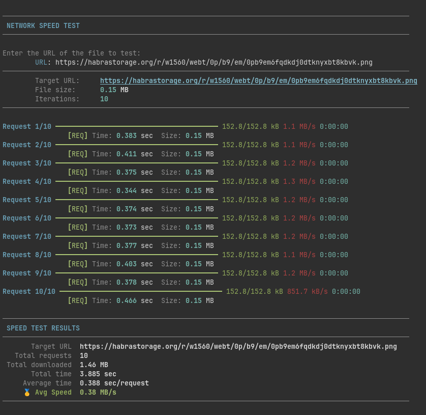

# Speed Test



## Стек

- Python 3.13+
- [httpx](https://pypi.org/project/httpx/) (for HTTP requests)
- [rich](https://pypi.org/project/rich/) (for rich text formatting)

## Метрики

- **Total time**: Общее затраченное время.
- **Average time**: Среднее затраченное время.
- **Total downloaded**: Общий объем полученных данных.
- **Average Speed**: Средняя скорость.

## Установка и использование

### Если вы используете `uv` это ваш путь

Установка

```bash
uv sync

```

Запуск

```bash
uv run python run.py
```

### Иначе

Создание виртуального окружения

```bash
python3 -m venv venv
source venv/bin/activate # On Windows: venv\Scripts\activate
```

Установка зависимостей requirements.txt

```bash
pip install -r requirements.txt
```

Запуск

```bash
python run.py
```
